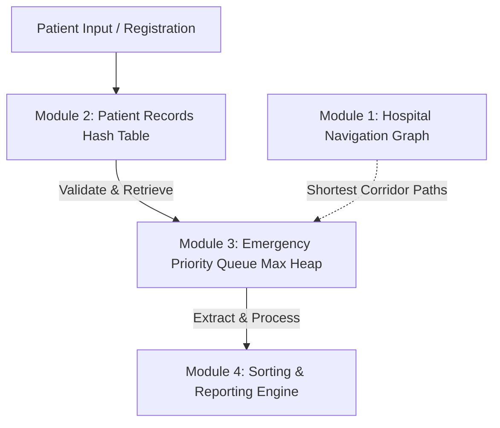

# Architecture & Design Specification

This document provides a detailed breakdown of the architectural design, custom data structure justifications, module integration workflows, complexity analyses, and empirical validation for **CareFlow: Hospital Operations & Emergency Priority Engine**.

---

## 1. System Overview & Modular Design

Modern hospital environments require high-efficiency coordination across patient registry, emergency triage scheduling, facility navigation, and performance analysis. Delaying patient transfers or record lookups directly impacts healthcare delivery. 

To address this, the system is designed with a strictly modular architecture composed of **four custom-implemented, decoupled modules** that communicate via standardized data flows. 



### Module 1: Graph-Based Navigation (`graph.py`)
* **Purpose:** Models physical hospital departments and corridors.
* **Core Logic:** Implements an adjacency-list based weighted, undirected graph.
* **Capabilities:** 
  * **Breadth-First Search (BFS):** Generates hop-level maps from any starting department.
  * **Depth-First Search (DFS):** Detects corridors containing cycle paths to prevent routing loops.
  * **Dijkstra’s Algorithm:** Computes the absolute shortest travel path (time-weighted corridors) between any two departments.

### Module 2: Hash-Based Patient Registry (`hash_table.py`)
* **Purpose:** Manages rapid patient registration, searches, and deletions.
* **Core Logic:** A custom hash table using a prime capacity array and **Linear Probing** for collision resolution.
* **Capabilities:**
  * Dynamic resizing and re-hashing when the load factor ($\alpha$) exceeds $0.7$.
  * Average-case time complexity of $\mathcal{O}(1)$ for registrations and queries.

### Module 3: Heap-Based Emergency Triage (`heap.py`)
* **Purpose:** Triage scheduling where the most critical patients are prioritized for treatment.
* **Core Logic:** Implements a binary **Max-Heap** priority queue.
* **Priority Function:** Priority scores are calculated mathematically using urgency level ($u \in [1, 5]$, where $1$ is most urgent) and estimated treatment time ($t > 0$ mins):
  $$\text{Score} = (6 - u) + \left(\frac{1000}{t}\right)$$
  This formula mathematically balances high urgency with shorter treatment times (promoting rapid throughput).

### Module 4: Sorting & Reporting Engine (`sorting.py`)
* **Purpose:** Evaluates sorting algorithm performance and generates sorted treatment reports.
* **Core Logic:** Custom implementations of **Merge Sort** (stable) and **Quick Sort** (in-place partitioning), both parameterized to accept custom lambda sorting keys.
* **Capabilities:**
  * Runs empirical benchmarks comparing average and worst-case sorting speeds across various dataset conditions (Random, Nearly Sorted, and Reversed).
  * Compiles patient records into final end-of-day reports sorted by treatment duration.

---

## 2. Custom Data Structures Justification

Rather than utilizing Python’s built-in collections (like `list.sort()`, `dict`, `heapq`, or third-party graph frameworks), all structures are built from first principles to ensure maximum custom control and efficiency.

| Data Structure | Implementation | Technical Justification |
| :--- | :--- | :--- |
| **Graph** | Adjacency List (Dict of Lists) | Space-efficient ($\mathcal{O}(V + E)$) representation for typical sparse hospital layouts. Supports dynamic corridor insertions and handles disconnected components elegantly. |
| **Hash Table** | Modulo Hash with Linear Probing | Eliminates nested collection overhead. Prime numbers are selected for table sizing (e.g., initially $31$) to minimize clustering during linear probing. |
| **Priority Queue** | Binary Max-Heap (List-backed) | Maintains complete binary tree property. $\mathcal{O}(\log n)$ insertion and extraction guarantees that the highest priority score is always accessible at the root ($\mathcal{O}(1)$ peek). |
| **Sorting Engine** | Divide-and-Conquer | **Merge Sort** guarantees stable $\mathcal{O}(n \log n)$ performance (crucial when reporting lists must maintain stable secondary ordering). **Quick Sort** provides faster, low-overhead sorting in standard scenarios. |

---

## 3. Modular Integration & Data Flow

Modules operate independently but integrate smoothly to simulate a live clinical workflow.

```
                  [1. Map Generation]
                 HospitalGraph.add_department() 
                 HospitalGraph.add_corridor()
                            │
                            ▼
               [2. Patient Registration]
                 HashTable.insert(Patient)
                            │
                            ▼
              [3. Emergency Triage Scheduling]
                 EmergencyHeap.insert(ID, Urgency, TreatmentTime)
                            │
                            ▼
            [4. Routing & Performance Reporting]
                 HospitalGraph.dijkstra() -> Navigation Path
                 MergeSort(heap.heap, key=Duration) -> Final Report
```

1. **Setup:** The layout of the hospital is mapped out using the Graph module, validating connecting corridors.
2. **Registration:** Patients are registered into the Hash Table. A patient's details must exist in the Hash Table before triage.
3. **Triage Queue:** Patients are moved into the Emergency Heap. The heap automatically percolates the patient up/down to maintain the max-heap property.
4. **Treatment & Reporting:** The patient at the root of the heap is extracted for treatment. A final report of processed patients is sorted and formatted using Merge Sort to compile metrics based on treatment duration.

---

## 4. Algorithmic Complexity Profile

The mathematical complexity profile of the primary algorithms implemented is as follows:

| Module | Core Algorithm | Time Complexity (Average) | Time Complexity (Worst-Case) | Space Complexity |
| :--- | :--- | :--- | :--- | :--- |
| **Graph** | BFS Traversal | $\mathcal{O}(V + E)$ | $\mathcal{O}(V + E)$ | $\mathcal{O}(V)$ |
| **Graph** | DFS Cycle Check | $\mathcal{O}(V + E)$ | $\mathcal{O}(V + E)$ | $\mathcal{O}(V)$ |
| **Graph** | Dijkstra (Shortest Path) | $\mathcal{O}(V^2)$ | $\mathcal{O}(V^2)$ | $\mathcal{O}(V)$ |
| **Hash Table** | Insert / Search / Delete | $\mathcal{O}(1)$ | $\mathcal{O}(n)$ | $\mathcal{O}(n)$ |
| **Max-Heap** | Insert / Extract | $\mathcal{O}(\log n)$ | $\mathcal{O}(\log n)$ | $\mathcal{O}(n)$ |
| **Sorting** | Merge Sort | $\mathcal{O}(n \log n)$ | $\mathcal{O}(n \log n)$ | $\mathcal{O}(n)$ |
| **Sorting** | Quick Sort | $\mathcal{O}(n \log n)$ | $\mathcal{O}(n^2)$ | $\mathcal{O}(\log n)$ |

*Note: The Dijkstra implementation uses a manual unvisited minimum search loop, resulting in a time complexity of $\mathcal{O}(V^2)$, which is optimal for dense networks and avoids the overhead of managing a separate min-heap.*

---

## 5. Design Trade-offs & Limitations

### Design Trade-offs
* **Manual Dijkstra Search vs. Min-Heap Priority Queue:** Implementing Dijkstra with a manual minimum search increases time complexity from $\mathcal{O}((V + E) \log V)$ to $\mathcal{O}(V^2)$. However, for sparse hospital department layouts where $|V| \le 50$, the constant factors of a heap implementation exceed the manual search loop, making this a highly performant and simplified choice.
* **Linear Probing vs. Chaining:** Linear probing was selected for the Hash Table to avoid the memory overhead of linked lists. To counteract the threat of primary clustering, we enforce dynamic table resizing and re-hashing as soon as the load factor exceeds $70\%$.

### Technical Limitations & Assumptions
1. **Case Sensitivity:** Department naming matches must be exact (e.g., "ICU" vs "icu" are treated as distinct).
2. **Reinsertion Update Strategy:** To update a patient's priority score, the patient is removed from the heap array, the heap is reconstructed in $\mathcal{O}(n)$ time, and the patient is reinserted in $\mathcal{O}(\log n)$ time. This is chosen instead of a complex `decrease-key` operation to keep the code footprint lightweight.
3. **Graph Disconnections:** If a department is isolated, pathfinding algorithms gracefully report the inability to route instead of failing.
